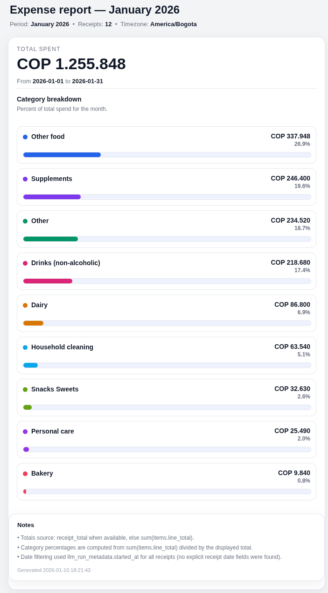

# expense-tracker

Local-first receipt pipeline that turns photos of receipts into structured data + a clean monthly spend report.



## What it does (today)

- **OCR receipts with Tesseract** (`ocr.txt`, plus extracted price hints like `prices.json`)
- **LLM receipt analysis** (OpenAI model, configurable in your `cfg/config.json`) to produce a normalized
  `receipt-analysis.json` (items, totals, categories, metadata)
- **Monthly HTML reports** that summarize totals + category breakdown (like the screenshot)

## How it works

1. You give it an image **or a folder of images** (`.jpg/.jpeg/.png`)
2. It runs OCR → then LLM analysis → then saves artifacts per receipt run directory
3. A report step aggregates receipt analyses into a **monthly expense report**

## Install

### System deps (Debian/Ubuntu)

Tesseract + Spanish language pack:
```bash
sudo apt update
sudo apt install -y tesseract-ocr tesseract-ocr-spa
```

Optional (useful if you compile / link against Tesseract in other tooling):
```bash
sudo apt install -y libtesseract-dev libleptonica-dev
```

### OpenAI API key

```bash
export OPENAI_API_KEY="..."
```

## Quickstart

```bash
go run ./src/cmd/receipt-pipeline \
  -config ./cfg/config.json \
  -image  ./receipts/ \
  -out    ./out \
  -language "eng+spa"
```

Outputs land in `./out/<month-year>/...` (OCR text + JSON analysis per receipt run directory), ready to be aggregated into reports.
